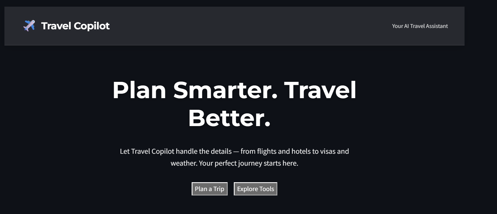
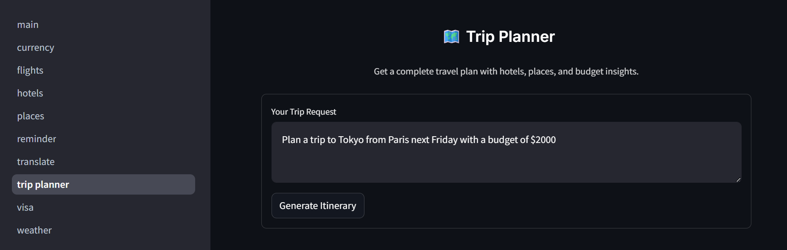
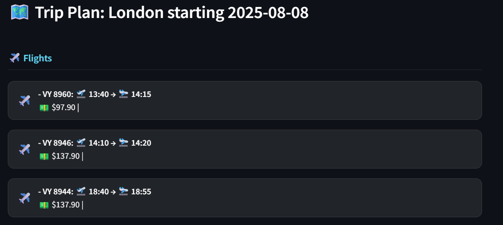
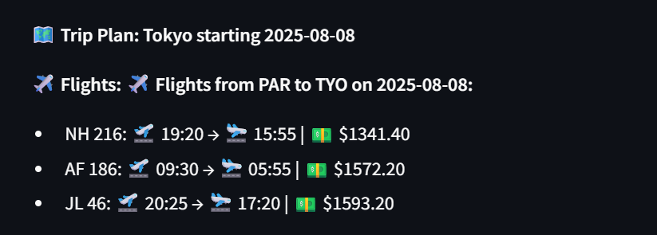
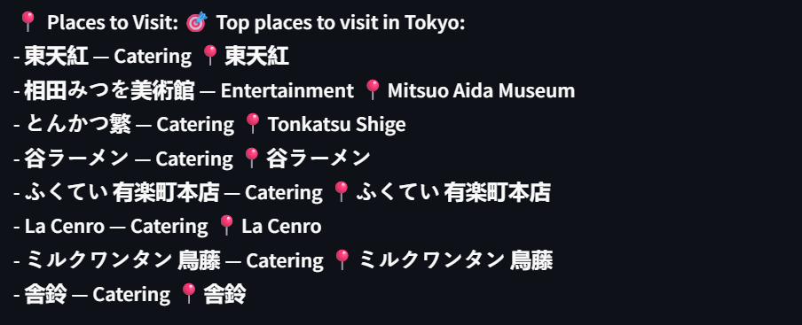
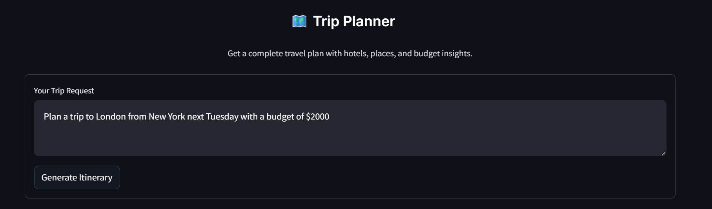
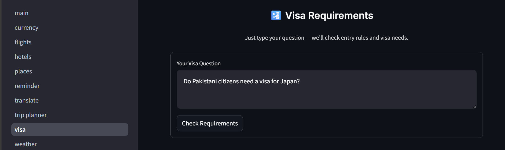
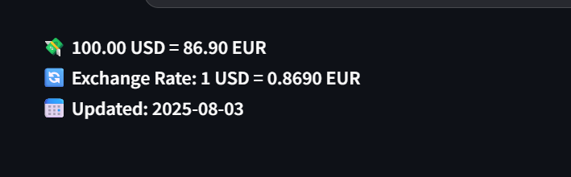

# 🌍 Travel Copilot — Your AI Travel Agent

Travel Copilot is an intelligent travel assistant that helps you plan trips with real-time flight data, hotels, places to visit, reminders, and more — all in one place.

Built as a **multi-agent system** using **LangGraph and Streamlit**, it understands natural language and delivers complete trip plans instantly.

> 📬 **For full backend code access (nodes, tools, graph), contact:**  
> [syedsaadi427@gmail.com](mailto:syedsaadi427@gmail.com)  
> *(Only Streamlit UI files are public — backend shared on collaboration request)*

---

## 🚀 What It Does

Travel Copilot acts as your personal travel agent. Just type a request like:

> _"Plan a trip to Paris next Friday with $2000"_  
> _"Find a flight from Dubai to London tomorrow"_  
> _"I want to visit Tokyo with hotels and top places"_

And it will return:
- ✈️ Real flight options with prices and times
- 🏨 Top hotels in the destination
- 🗺️ Places to visit (museums, restaurants, landmarks)
- ⏰ Trip reminders (15 days before)
- 💰 Budget insights
- 🛂 Visa info (if needed)
- 💬 Translation & currency conversion

All powered by **real APIs** and **AI routing**.

---

## ⚙️ Tech Stack

| Component | Technology |
|--------|------------|
| **Frontend** | Streamlit |
| **Agent Framework** | LangGraph |
| **LLM Router** | Mistral AI |
| **Flight Data** | Amadeus API (real flights) |
| **Hotels & Places** | Geoapify API |
| **Visa Info** | IATA Travel API |
| **Translation** | DeepL API |
| **Currency** | Open Exchange Rates |
| **Hosting** | Streamlit Community Cloud (future) |

✅ Fully modular  
✅ Scalable agent design  
✅ Natural language understanding

---

## 🖼️ Screenshots

### 🏠 Home Page

### 🧳 Trip Planner Interface

### ✈️ Flight Search Results

### 🏨 Hotel Recommendations

### 🗺️ Places to Visit

### 📅 Trip Reminder

### 🌍 Full Trip Plan Example

### 🛂 Visa Information

### 💬 Translation Tool

### 💵 Currency Conversion

---
